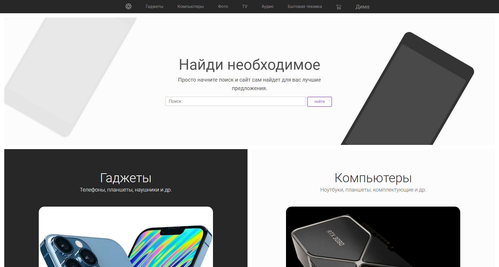
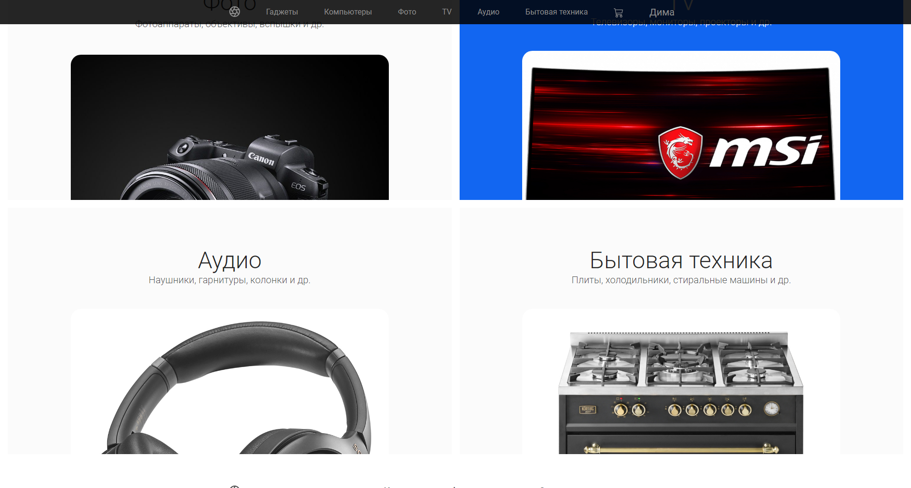
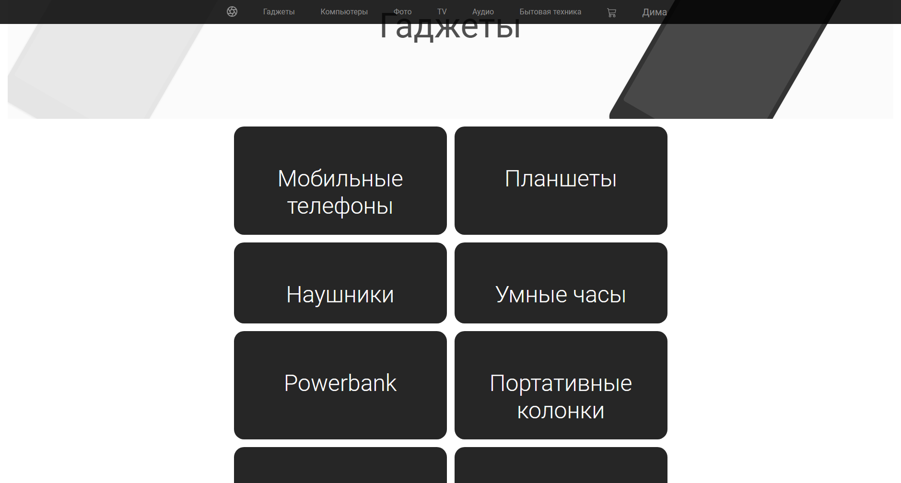
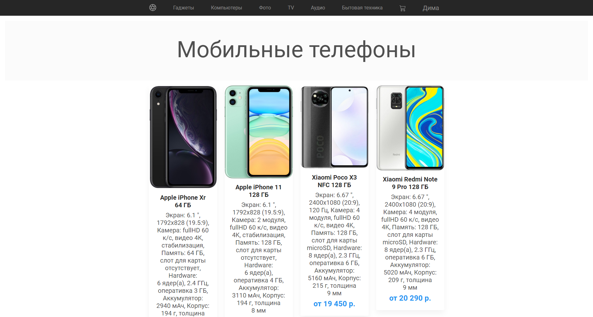
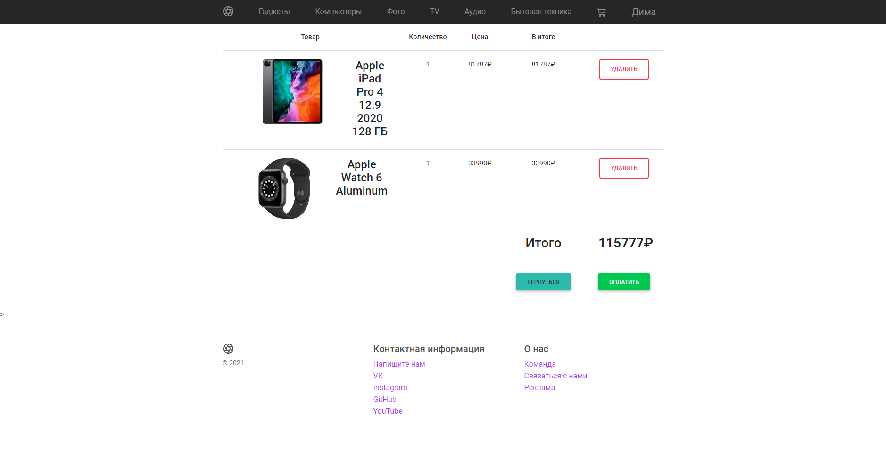
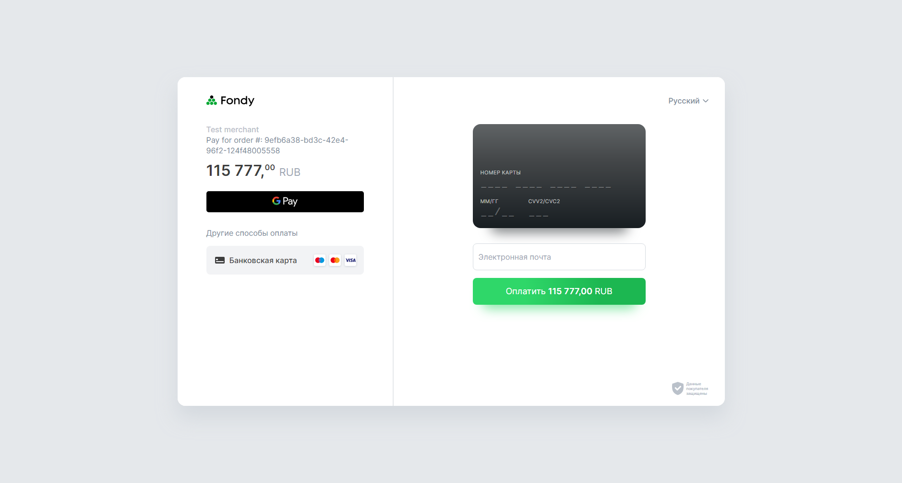
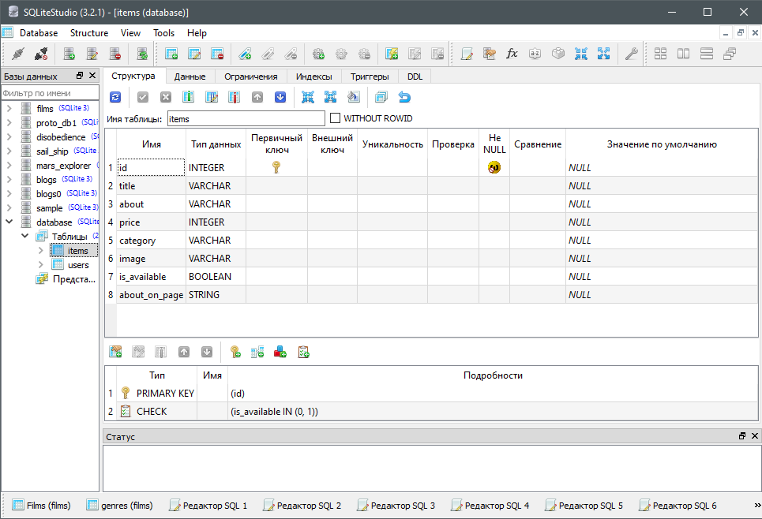

# OnlineShop

## Идея и суть проекта

Создать интернет-магазин, где можно найти и купить разные товары: от смартфонов и наушников до бытовой техники. Всего есть 6 категорий товаров: **Гаджеты**, **Компьютеры**, **Фото**, **TV**, **Аудио**, **Бытовая техника**.

Каждая из этих категорий разделяется на еще несколько подкатегорий:

- **Гаджеты:** Мобильные телефоны, планшеты, наушники, умные часы, powerbank'и, портативные колонки, action камеры, квадрокоптеры.*

- **Компьютеры:** ПК, ноутбуки, приставки, мониторы, комплектующие, клавиатуры и мыши, печать, Wi-Fi.*

Все товары находятся в базе данных. (см. приложения)

На данный момент в базу данных внесены товары **только** для **Гаджетов** и **Компьютеров**.

В проекте присутствует система пользователей, которые также хранятся в базе данных.

Только авторизированный пользователь может добавлять товары в *Корзину,* откуда позже сможет их оплатить либо убрать.

## Приложения

