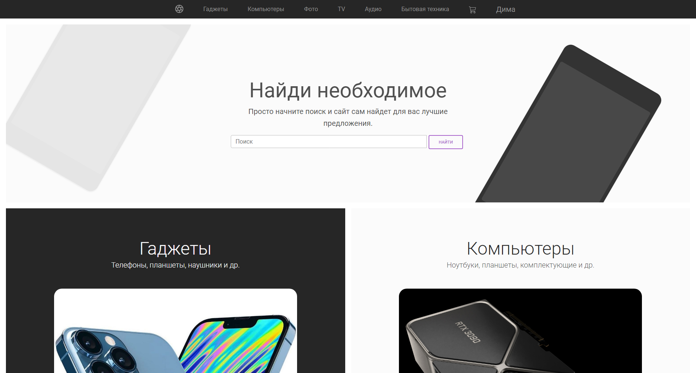
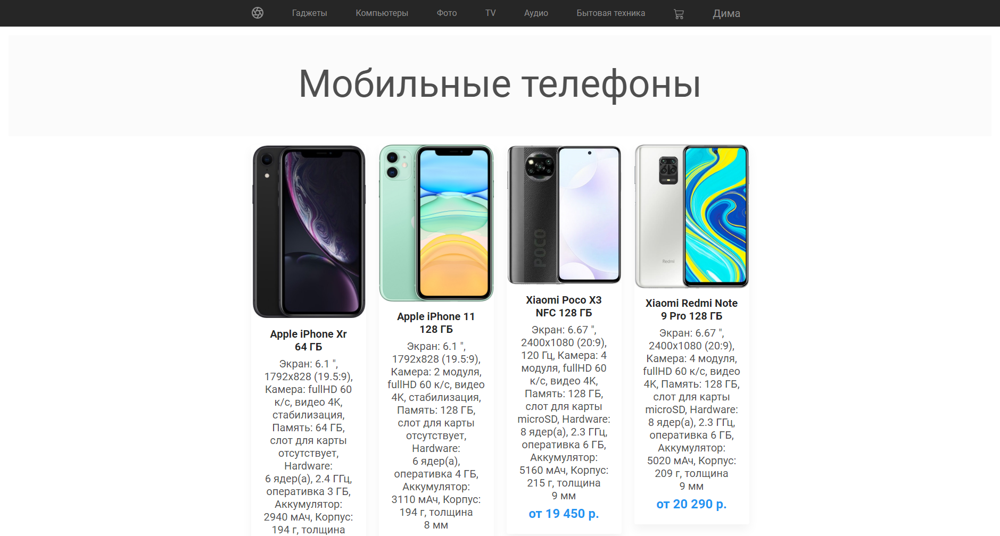
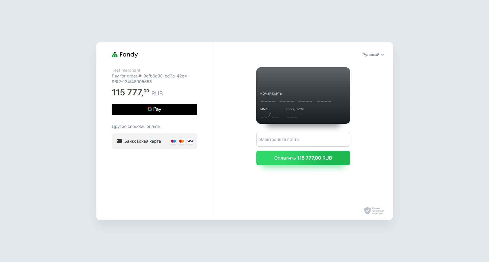

# OnlineShop

## Project Idea and Overview

Create an online store where users can browse and purchase various products, ranging from smartphones and headphones to home appliances.
There are a total of **6 product categories**: **Gadgets**, **Computers**, **Photo**, **TV**, **Audio**, **Home Appliances**.

Each of these categories is divided into several subcategories:

- **Gadgets:** Mobile phones, tablets, headphones, smart watches, power banks, portable speakers, action cameras, quadcopters.

- **Computers:** PCs, laptops, game consoles, monitors, components, keyboards and mice, printing devices, Wi-Fi equipment.

All products are stored in a database (see attachments).

At the moment, the database contains products **only** for the **Gadgets** and **Computers** categories.

The project includes a user system, with users also stored in the database.

Only an **authorized user** can add products to the *Cart*, from which they can later proceed to payment or remove items.

## Attachments

