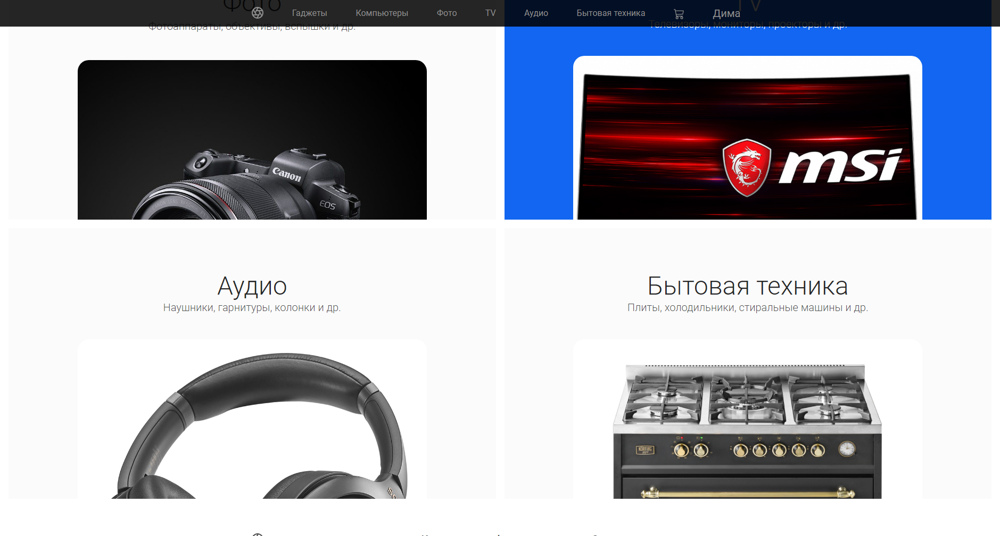
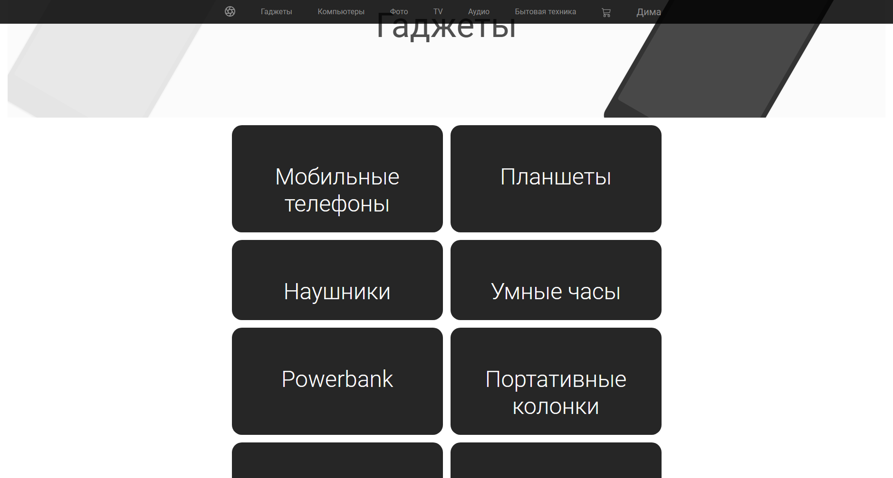
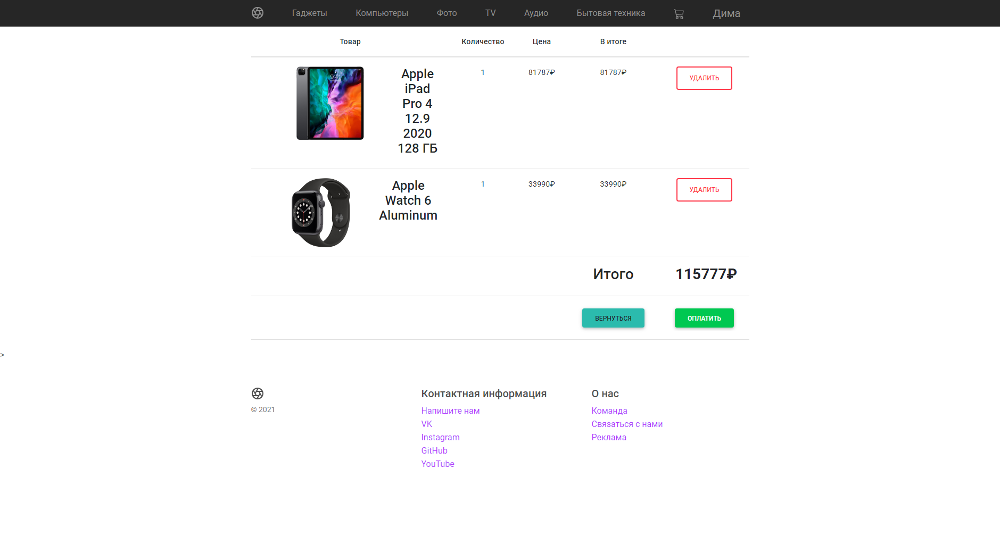

# OnlineShop

## Project Idea and Overview

The goal of this project is to create an online store where users can browse and purchase a wide range of products, from smartphones and headphones to home appliances. The store includes **6 main product categories**:

- Gadgets  
- Computers  
- Photo  
- TV  
- Audio  
- Home Appliances

Each category is divided into several subcategories.

### Gadgets
- Mobile phones  
- Tablets  
- Headphones  
- Smart watches  
- Power banks  
- Portable speakers  
- Action cameras  
- Quadcopters

### Computers
- PCs  
- Laptops  
- Consoles  
- Monitors  
- Components  
- Keyboards and mice  
- Printing devices  
- Wi‑Fi equipment

All products are stored in a database (see appendices).

At the current stage of development, the database contains products **only for the Gadgets and Computers categories**.

## User System

The project includes a user authentication system. All users are stored in the database.

Only **authorized users** are allowed to add products to the **Cart**, where they can later proceed to checkout or remove items.

## Screenshots

